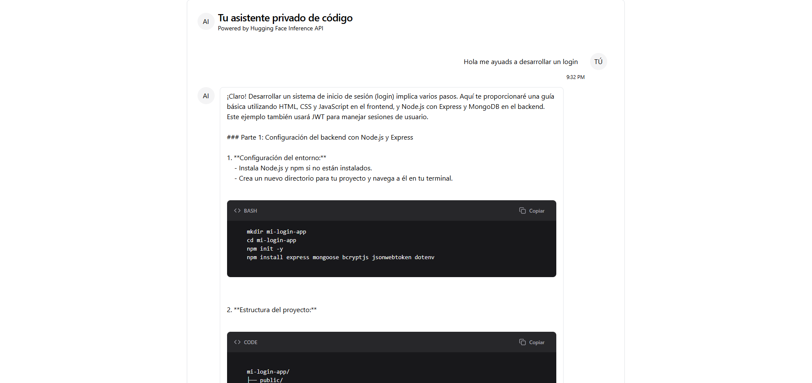

# Chat AI Code Assistant

Un asistente de código basado en IA que utiliza el modelo Qwen a través de la API de Hugging Face para proporcionar ayuda con programación en un formato de chat interactivo.



### URLs
- **Local**: http://localhost:5173
- **Producción**: https://chat-ai-assistant.vercel.app

## 🚀 Características

- **Interfaz de Chat Moderna**: Diseño limpio y responsive con soporte para mensajes de usuario y asistente
- **Resaltado de Código**: Bloques de código con formato automático y detección de lenguaje
- **Funcionalidades de Código**:
    - Copiar código con un clic
    - Indicador visual de código copiado
    - Soporte para múltiples lenguajes de programación
- **Experiencia de Usuario Mejorada**:
    - Scroll automático a nuevos mensajes
    - Indicador de escritura
    - Avatares para usuario y asistente
    - Marcas de tiempo en los mensajes

## 🛠️ Tecnologías Utilizadas

- **React**: Framework principal para la interfaz de usuario
- **Hugging Face Inference**: API para el modelo de IA
- **Tailwind CSS**: Estilos y diseño responsive
- **Shadcn/ui**: Componentes de UI prediseñados
- **Lucide React**: Iconos vectoriales
- **TypeScript**: Tipado estático para mejor desarrollo

## 📦 Estructura del Proyecto

```
todo-list-react/
│
├── public/
│   └── index.html
│
├── src/
│   ├── components/
│   │   ├── ChatInterface.tsx
│   │   └── ui/
│   │       ├── Button.tsx
│   │       ├── Avatar.tsx
│   │       ├── ScrollArea.tsx
│   │       ├── Card.tsx
│   │       └── TextArea.tsx
│   │   
│   │
│   │
│   ├── App.js
│   └── index.js
│
├── package.json
└── README.md
```

## 📦 Instalación

```bash
# Clonar el repositorio
git clone [url-del-repositorio]

# Instalar dependencias
npm install


# Iniciar el servidor de desarrollo
npm run dev
```

## 🔧 Configuración

1. Obtén una API key de Hugging Face
2. Configura la variable de entorno `HUGGING_FACE_API_KEY`
3. Opcionalmente, ajusta el modelo en el archivo de configuración

## 💻 Uso

1. Escribe tu pregunta o código en el campo de texto
2. Presiona Enter o el botón de enviar
3. El asistente responderá con explicaciones y ejemplos de código
4. Usa el botón de copiar para copiar fragmentos de código
5. Los mensajes se guardan en la sesión actual

## 🎨 Personalización

### Temas
El componente utiliza variables CSS personalizables para colores y estilos:


### Componentes
Puedes modificar los componentes individuales en la carpeta `components/`:
- `ChatInterface.tsx`: Componente principal
- `ui/`: Componentes de UI reutilizables

## 📈 Próximas Mejoras

- [ ] Soporte para imágenes y archivos
- [ ] Persistencia de mensajes
- [ ] Temas claros/oscuros
- [ ] Más lenguajes de programación
- [ ] Exportar conversaciones
- [ ] Búsqueda en el historial

## 🤝 Contribución

1. Fork del repositorio
2. Crea una rama para tu feature (`git checkout -b feature/AmazingFeature`)
3. Commit de tus cambios (`git commit -m 'Add some AmazingFeature'`)
4. Push a la rama (`git push origin feature/AmazingFeature`)
5. Abre un Pull Request

## 📝 Licencia

Este proyecto está bajo la Licencia MIT 

## ⭐️ Créditos

- Modelo de IA: [Qwen/Qwen2.5-Coder-32B-Instruct](https://huggingface.co/Qwen/Qwen2.5-Coder-32B-Instruct)
- Componentes UI: [shadcn/ui](https://ui.shadcn.com/)
- Iconos: [Lucide](https://lucide.dev/)